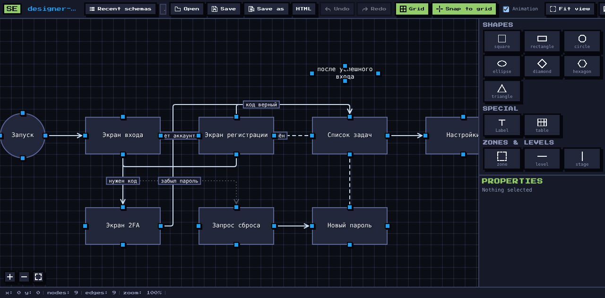

# SEditor

**Лёгкий редактор логических схем, архитектурных карт и блок-схем** — одна HTML-страница,
которая открывается двойным кликом и работает без установки и без интернета.

Дизайн — пиксельное ретро в духе NES.css. Весь CSS и JS собраны в один файл `app/editor.html`,
поэтому папку `app/` можно скопировать куда угодно и открыть как есть.



<p>


</p>

---

## Быстрый старт

### Открыть схему

Двойной клик по HTML-ярлыку рядом со схемой — редактор откроется сразу, **сервер не нужен**.

```bash
node app/create-shortcut.mjs ../example_scheme/example-flow.json
# создан ../example_scheme/example-flow.html — открывайте его
```

> **Ярлык хранит копию схемы внутри себя.** `file://` в браузере запрещает читать соседний
> JSON (`fetch`, XHR и `import()` блокируются), поэтому данные вшиты прямо в ярлык.
> Следствие: после правки JSON ярлык нужно перегенерировать — это одна команда выше.

### Расширенный режим (опционально)

Локальный backend добавляет список последних схем, запись JSON/PNG сразу на диск и кнопку
создания ярлыка внутри редактора:

```bash
node app/server.js     # → http://127.0.0.1:5174/editor.html
```

Без backend редактор тоже умеет сохранять: JSON и PNG пишутся в папку, выбранную один раз
(File System Access API, handle живёт в IndexedDB).

---

## Как это работает

Редактор открывает схему двумя способами:

| Способ | Откуда данные | Сервер | Что доступно |
| --- | --- | --- | --- |
| **Ярлык** `.SEditor/<slug>.html` | данные вшиты в ярлык (`#d=<json>`) | не нужен | редактирование, сохранение JSON/PNG в выбранную папку |
| **Backend** `?path=<json>` | читается с диска на каждый открытие | `node app/server.js` | всё выше + «последние схемы», запись по любому пути, кнопка `HTML` |

Ярлык при открытии редиректит в общий `app/editor.html` и передаёт схему через hash. `<`
в данных экранируется как `\u003c`, поэтому подпись вида `</script>` не может сломать страницу.

---

## Возможности

<table>
<tr><td valign="top" width="50%">

**Холст**

- Фигуры: квадрат, прямоугольник, круг, эллипс, ромб, гексагон, треугольник
- Надпись, таблица, зона, уровень, стадия
- Связи с любой из 4 граней: надпись, стиль, тип и направление линии
- Сетка, привязка к сетке, анимация связей
- Панорамирование и зум, «показать всё»

</td><td valign="top" width="50%">

**Панели**

- Имя схемы = имя JSON-файла
- Последние схемы, путь к файлу
- Открыть / Сохранить / Сохранить как
- Undo / Redo
- Экспорт PNG
- Палитра фигур и свойства выделенного
- Язык интерфейса РУ / АНГЛ, тёмная тема

</td></tr>
</table>

Зоны, уровни и стадии при сохранении пересчитываются из геометрии и записываются
в JSON как взаимосвязи объекта (`zones`, `levels`, `stages`).

### Горячие клавиши

| Сочетание | Действие |
| --- | --- |
| `Ctrl/Cmd + Z` | отменить |
| `Ctrl/Cmd + Shift + Z`, `Ctrl + Y` | вернуть |
| `Ctrl/Cmd + A` | выделить всё |
| `Ctrl/Cmd + D` | дублировать |
| `Ctrl/Cmd + S` | сохранить |
| `Delete` / `Backspace` | удалить выделенное |
| `↑ ↓ ← →` | сдвиг на 1 px (`Shift` — на 10) |
| `Esc` | снять выделение |

---

## Формат схемы

```json
{
  "version": 1,
  "meta": { "name": "example-flow", "app": "SEditor", "updated": "2026-01-01T00:00:00.000Z" },
  "nodes": [
    {
      "id": "n1",
      "type": "shape",
      "position": { "x": 0, "y": 0 },
      "width": 160,
      "height": 80,
      "data": {
        "shape": "rect",
        "label": "Начало",
        "labelPos": "inside",
        "desc": "",
        "zones": ["z1"],
        "levels": [{ "id": "l1", "side": "above" }]
      }
    }
  ],
  "edges": [
    {
      "id": "e1",
      "source": "n1",
      "target": "n2",
      "sourceHandle": "right",
      "targetHandle": "left",
      "type": "straight",
      "data": { "label": "да", "dash": "solid", "marker": "arrow", "arrow": "end" }
    }
  ],
  "viewport": { "x": 0, "y": 0, "zoom": 1 }
}
```

| Поле | Значения |
| --- | --- |
| `data.shape` | `square`, `rect`, `circle`, `ellipse`, `diamond`, `hexagon`, `triangle`, `label`, `table`, `zone`, `level`, `stage` |
| `sourceHandle` / `targetHandle` | `top`, `right`, `bottom`, `left` |
| `data.labelPos` | `inside`, `top`, `right`, `bottom`, `left` |
| `edge.type` | `straight`, `step`, `smoothstep` |
| `data.dash` | `solid`, `dashed`, `dotted` |
| `data.marker` | `none`, `arrow`, `triangle`, `circle` |

---

## Файловый API

Backend не имеет зависимостей — только `node:http` и `node:fs`.

| Метод | Путь | Назначение |
| --- | --- | --- |
| `GET` | `/api/schemas` | список схем рядом с редактором (по времени) |
| `GET` | `/api/fs?path=` | листинг директории для диалога открытия/сохранения |
| `GET` | `/api/schema?path=` | чтение схемы |
| `POST` | `/api/schema` | запись схемы `{ path, data }` |
| `POST` | `/api/png` | сохранение PNG `{ path, dataUrl }` |
| `POST` | `/api/shortcut` | создание/обновление HTML-ярлыка `{ path }` |
| `GET` | `/api/runtime` | отдача рантайма с проверкой контрольных сумм |

Статика отдаётся только из папки `app/`; файловый API работает с любым путём на диске
(потому и слушает только `127.0.0.1` по умолчанию). Тело запроса ограничено 64 МБ.

---

## Разработка

```bash
npm install

npm run dev     # Vite на :5173 с живой перезагрузкой и прокси /api
npm start       # в другом терминале — backend на :5174
npm run build   # собирает src/ в один app/editor.html
npm test        # геометрия + регрессия ярлыков и backend + контрольные суммы релиза
```

| Переменная | По умолчанию | Значение |
| --- | --- | --- |
| `PORT` | `5174` | порт backend |
| `HOST` | `127.0.0.1` | интерфейс; `0.0.0.0` — только на доверенной машине |

> `app/editor.html` — **артефакт сборки**, не редактируйте его вручную. Правьте `src/`
> и запускайте `npm run build`. Контрольные суммы релиза лежат в `app/version.json`.

---

## Структура

```text
app/                     рантайм: редактор, backend, генератор ярлыков
  editor.html            ИСПОЛНЯЕМАЯ СТРАНИЦА — собранный из src/ один файл
  server.js              статика + файловый API без зависимостей
  create-shortcut.mjs    генератор HTML-ярлыков (данные схемы внутри)
  launcher.js            общий рендер ярлыка: Node и браузер
  shortcut.html          шаблон ярлыка
  editor.test.mjs        регрессия ярлыков и backend
  version.test.mjs       проверка контрольных сумм релиза
  version.json           версия рантайма и sha256 каждого файла
  vite/dev/svelte.config.js   сборка и dev-сервер
src/                     исходники; собирается в app/editor.html
  lib/                   config, geometry, schema, board, history, i18n, exportPng,
                         api, launcher, fsHandles, icons
  components/            Editor, TopBar, FlowCanvas, Palette, Inspector, BottomBar,
                         EdgePath, EdgeFields, nodes/, PixelIcon
example_scheme/          пример схемы и его HTML-ярлык
docs/editor.png          скриншот для README
```

`app/editor.html` собран и лежит в репозитории, поэтому клонированный проект работает сразу.

---

## Использование как библиотека схем

Формат SEditor v1 используют агентные навыки для генерации визуальных карт проекта —
например [`SEskill`](https://github.com/Fluttershy174PUNK/SEskill) пишет схемы в `.SEditor/`
и ставит этот редактор как управляемый рантайм.

---

## Лицензия

Лицензия не указана. Открывайте issue, если нужна явная.
